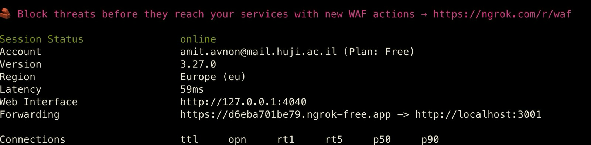

# Secure Anonymous Messaging & Polling Platform - Design Document

A privacy-preserving communication platform implementing end-to-end encryption, anonymous message routing, and cryptographically secure polling with comprehensive anonymity guarantees.

## Project Overview

### Problem Space

WhatsApp's polling feature, while functional for basic voting, lacks privacy options that would enable anonymous participation and prevent social manipulation. In WhatsApp polls, all votes are immediately visible to every participant by design, but this transparency creates limitations for sensitive voting scenarios.

**Vote Visibility Limitations**: When users cast votes in WhatsApp polls, their choices are instantly revealed to all group members. While this transparency is probably intentional, it creates challenges for sensitive topics - users may hesitate to express honest opinions on controversial subjects due to fear of judgment which might lead to social pressure scenarios. Visible voting can lead to conformity rather than authentic choice expression.

### Solution Importance
Our application addresses those critical gaps in existing solutions by providing:

- **Anonymous Voting**: Polls where individual votes remain completely hidden from all users, including administrators
- **Metadata Protection**: Communication patterns obscured through mixnet routing
- **End-to-End Security**: Messages encrypted client-side with keys never exposed to servers
- **Verifiable Privacy**: Users can validate their security through visual indicators and detailed logging

By doing so, we enable users to express their authentic thoughts without fear of being judged and without social pressure scenarios, fostering honest feedback collection. Additionally, we provide secure private and group messaging capabilities that extend beyond polling to comprehensive communication privacy.

### Our Solution vs State-of-the-Art

Our application implements a comprehensive privacy-preserving communication platform with secure group messaging, private conversations, and anonymous polling capabilities. Unlike existing solutions, our platform combines multiple cryptographic techniques to provide both content confidentiality and metadata anonymity.

**Key Security Features: (detailed specifications provided in subsequent sections)**
- **PIR-Enhanced Anonymous Polling**: Uses Private Information Retrieval for untraceable vote token acquisition
- **Three-Layer Mixnet**: Messages pass through multiple mix nodes with batching, shuffling, and random delays
- **Dual Encryption Architecture**: OpenPGP for messages, ElGamal for poll votes
- **Visual Security Validation**: Real-time indicators showing encryption and anonymization status

### Attacker Model & Assumptions

**Threat Model:**
- **Honest-but-Curious Server**: Server follows protocol but may attempt to analyze stored data
- **Network Adversary**: Can observe network traffic patterns and timing
- **Malicious Users**: Other participants may attempt to compromise privacy
- **Social Engineering**: Attackers may try to correlate votes with users through side channels

**Assumptions:**
- Users' devices and browsers are secure and not compromised
- Cryptographic primitives (OpenPGP, ElGamal, RSA-OAEP) are secure
- At least one mixnet node operates honestly
- Users can verify security indicators in the interface

### Design Motivation

Our architecture addresses the attacker model through defense-in-depth:

1. **Client-Side Encryption**: Prevents honest-but-curious server from reading content
2. **Mixnet Routing**: Breaks timing and pattern analysis by network adversaries
3. **Anonymous Tokens**: Prevents vote linking while maintaining double-voting protection
4. **Crypto State Rotation**: Limits long-term pattern analysis across multiple polls
5. **Visual Verification**: Enables users to validate their security assumptions

## Enhanced Key Security Features

### Message Security Features

**End-to-End Encryption**

Our platform implements robust end-to-end encryption to ensure complete message confidentiality between users.

- **Implementation**: Advanced elliptic curve cryptography provides strong security with efficient performance for all message types including private conversations and group communications
- **Key Management**: Cryptographic keys are generated entirely within the user's browser using secure random number generation, ensuring private keys never leave the user's device or pass through our servers
- **Multi-Recipient Support**: Group messages are individually encrypted for each participant using their unique public key, ensuring that even if one participant's key is compromised, other participants' messages remain secure
- **Forward Secrecy**: The encryption system provides protection against future key compromises by ensuring that past communications cannot be decrypted even if current keys are exposed
- **Automatic Key Distribution**: Public keys are automatically exchanged between users when they join conversations, eliminating manual key management while maintaining security

**Three-Node Mixnet Anonymization**

Beyond encryption, our mixnet system provides metadata anonymity by obscuring communication patterns and sender-receiver relationships.

- **Architecture**: Every message passes through a carefully designed cascade of three independent mix nodes, each performing different anonymization operations to break traceability
- **Batching and Shuffling**: Messages are collected into batches at each node and cryptographically shuffled to prevent correlation between incoming and outgoing messages
- **Random Delay Injection**: Each mix node introduces randomized delays to prevent timing analysis attacks that could reveal communication patterns
- **Traffic Analysis Resistance**: The combination of batching, shuffling, and delays makes it computationally infeasible for observers to determine who is communicating with whom
- **Processing Verification**: The system tracks each message's progress through all three nodes, ensuring complete anonymization before delivery
- **Visual Confirmation**: Users receive real-time feedback showing when their messages have successfully completed the full mixnet cascade through security indicators

**Message Security Workflow**

Private messages follow a secure four-stage process: first, elliptic curve key pairs are generated in each user's browser and public keys are exchanged automatically; second, messages are encrypted using the recipient's public key with an additional copy encrypted for the sender's own message history; third, encrypted messages are routed through our three-node mixnet cascade where they undergo batching, shuffling, and random delay injection to break timing correlations; finally, fully anonymized messages are delivered to recipients who decrypt them using their private keys, with visual indicators (🔒🔀) confirming both encryption and successful mixnet processing. 
🔒 - Indicates a successful encryption completed 🔀 - Indicates a successful mixing network (mixnet) operation completed.

Group messages use a parallel encryption approach where each message is individually encrypted for every participant using their unique public keys, ensuring that compromise of one key doesn't affect others. The encrypted messages are then processed through the same three-node mixnet system in parallel streams, with each recipient receiving their personalized encrypted content after complete anonymization, maintaining both confidentiality and metadata privacy at scale. The encryption (🔒) and mixnet (🔀) status indicators are also displayed for group messages, showing when messages are successfully encrypted and mixed within group conversations.

### Polling Security Features

**Anonymous Vote Token System**
- **PIR Integration**: Private Information Retrieval enables untraceable token acquisition
- **Server Blindness**: System cannot determine which tokens users retrieve
- **Unlinkable Voting**: No correlation between token acquisition and vote submission

**Cryptographic Vote Protection**
- **Vote Encryption**: Strong asymmetric encryption protects ballot confidentiality
- **Vote Mixing**: Dedicated mixnet shuffles encrypted votes before decryption
- **Authentication Tokens**: Cryptographically signed one-time voting credentials
- **State Rotation**: Keys and secrets refreshed after each poll to prevent correlation

**Anonymous Polling Workflow**

Anonymous polls operate through a sophisticated multi-stage process designed to ensure complete voter privacy. When a poll is created, the server generates unique ElGamal encryption keys and distributes the public key to all participants while sending a special finalization token only to the poll creator. Voters acquire anonymous voting tokens through Private Information Retrieval (PIR), where they can select tokens from a database of 128-256 options without the server knowing which token was chosen, ensuring unlinkable vote submission. Each vote is encrypted using strong asymmetric encryption with a stable voter nonce and timestamp, then submitted with the anonymous token to prevent double-voting while maintaining anonymity. All encrypted votes are collected and shuffled through a dedicated VoteMixnet before decryption, ensuring that even the final vote tallies cannot be correlated with individual voters. Upon poll finalization by the creator, votes are decrypted in batch, tallied with nonce-based deduplication, and results are broadcast while all cryptographic state is rotated to prevent cross-poll correlation.

### Enhanced Privacy Protection

**Chat History Management**:
- **Automatic Clearing**: Private message history is cleared when the conversation is closed.
- **Session Isolation**: Reopening chats creates fresh conversation contexts.
- **Memory Protection**: Decrypted messages remain only in browser memory.
- **No Server Storage**: Plaintext messages never stored on the server.

## User Validation & Testing

### Visual Security Indicators

Users can validate their traffic security through real-time visual indicators:

- **🔒 Encryption Indicator**: Appears on all messages encrypted with OpenPGP
- **🔀 Mixnet Indicator**: Appears only when message completes full 3-node cascade
- **Security Status Panel**: Real-time display of encryption and mixnet status
- **Vote Confirmation**: Visual feedback when anonymous votes are successfully queued

### Comprehensive logging support

The application provides comprehensive logging that documents all traffic status from source to destination, tracking message encryption, mixnet processing through all three nodes, and anonymous poll operations. This detailed logging system allowed us to verify that everything is working as expected and functioning correctly, enabling complete monitoring of the security pipeline to ensure proper encryption, anonymization, and delivery of all communications.

### Mixnet Polling Verification

The system continuously polls mixnet processing to ensure all traffic routes through all the mix servers successfully, and reported the progress the logs.

### Poll Verification Methods


## Technical Implementation

### Core Application Files

- **`app.py`** - Main Flask-SocketIO server implementing all socket handlers, mixnet initialization, and anonymous polling integration. Manages user sessions, message routing, and poll lifecycle.

- **`crypto/mixnet.py`** - Three-node mixnet implementation with MixNode class for individual nodes and MixnetManager for cascade orchestration. Handles message batching, shuffling, delay injection, and delivery verification.

- **`crypto/elgamal.py`** - ElGamal encryption implementation for anonymous poll vote encryption. Provides RSA-backed ElGamal-style interface with key generation and decryption capabilities.

- **`models/anonymous_polls.py`** - Complete anonymous polling system with TallyAuthority for vote decryption, AnonTokenAuthority for HMAC token management, and VoteMixnet for vote shuffling. Implements PIR token distribution and crypto state rotation.

- **`models/message.py`** - Message model classes including Message, PrivateMessage, EncryptedMessage, EncryptedPrivateMessage, and EncryptedGroupMessage. Handles serialization and message type management.

- **`models/user.py`** - User model with OpenPGP key management, session tracking, and encryption key storage. Manages user state and public key distribution.

### Client-Side Implementation

- **`public/index.html`** - Enhanced UI with security status panel, encryption indicators, and real-time security feature display. Includes Socket.IO and OpenPGP.js library integration.

- **`public/client.js`** - Complete client-side application logic including OpenPGP key generation, message encryption/decryption, anonymous poll voting with PIR, and security indicator management. Handles all user interactions and server communication.

- **`public/crypto-utils.js`** - OpenPGP cryptography utilities implementing ECC Curve25519 key generation, message encryption/decryption, and crypto system testing. Provides browser-side security validation.

- **`public/styles.css`** - UI styling including security indicator animations, encryption status colors, and mixnet processing visual feedback.

### Supporting Files

- **`crypto/pir.py`** - Private Information Retrieval implementation for anonymous vote token acquisition. Enables users to retrieve tokens without revealing which token was selected.

- **`requirements.txt`** - Python dependencies including Flask-SocketIO, cryptography libraries, and numerical computation packages.

- **`setup.py`** - Installation script with Python version checking and virtual environment setup automation.

## Project Structure

```
proj1/
├── app.py                   # Main Flask-SocketIO server with mixnet integration
├── crypto/                  # Cryptographic implementations
│   ├── __init__.py
│   ├── elgamal.py           # ElGamal encryption for anonymous polls
│   ├── mixnet.py            # Three-node mixnet for message anonymization
│   └── pir.py               # Private Information Retrieval for vote tokens
├── models/                  # Data models and business logic
│   ├── __init__.py
│   ├── anonymous_polls.py   # Complete anonymous polling system
│   ├── message.py           # Message models with encryption support
│   ├── tests_for_anonymous_polls.py  # Poll system test suite
│   └── user.py              # User model with OpenPGP key management
├── public/                  # Client-side application
│   ├── index.html           # Enhanced UI with security indicators
│   ├── client.js            # Main client application with encryption
│   ├── crypto-utils.js      # OpenPGP cryptography utilities
│   ├── crypto-fallback.js   # Fallback crypto implementations
│   └── styles.css           # UI styling with security indicators
├── requirements.txt         # Python dependencies
└── setup.py                # Installation and setup script
```

## Setup & Installation

### Prerequisites

- Python 3.9+ (recommended Python 3.11+)
- pip (Python package manager)
- Modern browser with Web Crypto API support

### Running the Application

1. Run the setup script which will automatically create a virtual environment with all needed dependencies and start the server on port 3001:
   ```bash
   python setup.py
   ```

2. **Local Testing (Single Computer)**: After running the server using the setup.py file, you can start using the app. To simulate several users, open multiple tabs in your browser and navigate to http://localhost:3001.

3. **Remote Testing (With Friends)**: If you want to try this application with friends, follow these instructions:
   - In one terminal, run the setup.py file which will start the server
   - Open a new terminal
   - Create an account on [ngrok](https://ngrok.com/)
   - Follow the installation instructions in these guides, and run the commands described there in the second terminal:
     - [Mac users installation guide](https://dashboard.ngrok.com/get-started/setup/macos)
     - [Windows users installation guide](https://dashboard.ngrok.com/get-started/setup/windows)
   - make sure to edit the last command to use port 3001
   - Share the generated ngrok link with your friend and start using the app together!
